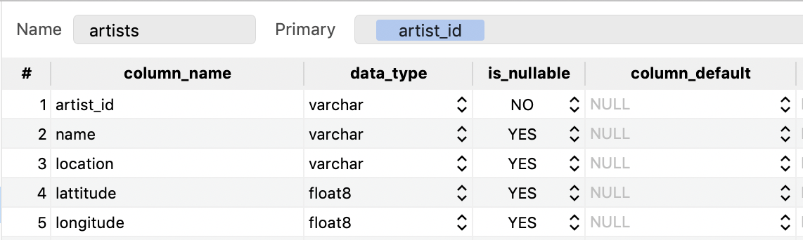

# Data Modeling with Postgres

## Intro to the Dataset
There are a total of 71 song_data json files that contain metadata 
about artists, user and songs. This is the primary source for the 
Dimension Tables.

There are several log_data json files that contain several lines each
of songplay events. The ones with page = "NextSong" are the ones we're 
interested in as they represent the actual instance of a song being played.

We build our Fact table from these files, fetching references to Dimension
Tables based on certain strings matching between the two subsets of files.

## Purpose
The purpose of building this database using a Star Schema is to enable 
ease of querying the songplay history by translating the log_events into a Fact
Table referencing Dimension Tables relating to songs, artists, users and time of play.

## Schema design

Our primary Fact table is the Songplays table shown below.  

Following are Dimension tables that store metadata about artists, songs, 
timestamp and users respectively.

## Justification for Schema Design and ETL pipeline
Star schema is apt for this database, since there is one central source
of event which stems from songplay and all metadata information is centered
around this event play.

Also, considering the relatively small size of the day, and the fact that 
the queries may not be known ahead of time, relational database with fairly
normalized representation is ideal for our needs.

## Files in the Repository and Running the code
create_tables.py is responsible for clearing the previous tables
and creating new tables according to the template in sql_queries.py.
Open create_ables.py and in create_database, edit the postgres connection
information as needed. There should be a default database called studentdb
and user with username/password student/student with createDB permissions.

Run create_tables.py to create the initial tables.
> python create_tables.py
Execute etl.ipynb to see a sample table with just one song being used.

Again run create_tables.py to clear out the old table, after resetting
the jupyter notebook connection.

Now, run etl.py to generate tables with the full data.

Run test.ipynb in jupyter notebook to verify table contents.