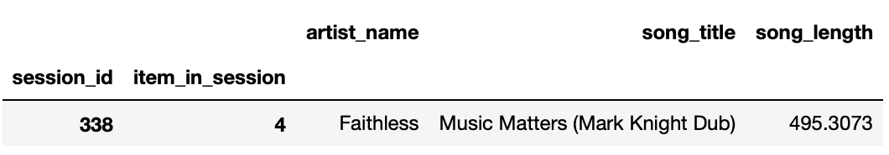
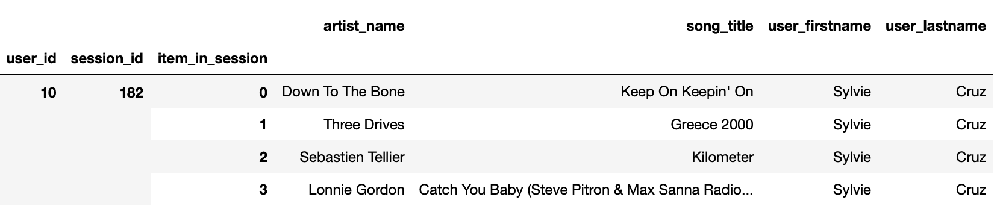
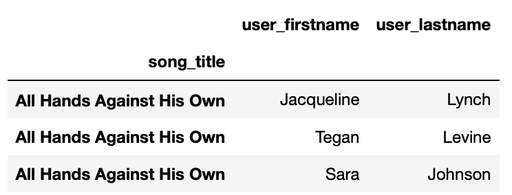

# Data Modeling in Apache Cassandra

### Intro
The jupyter notebook in this workspace creates a unified csv of song and user
activity, from several csv files in the event_data folder, and then proceeds to
create three different tables in a keyspace modeled for answering three separate
queries.

### Data Modeling

#### Q1. Give me the artist, song title and song's length in the music app history that was heard during  sessionId = 338, and itemInSession  = 4
```
CREATE TABLE IF NOT EXISTS songs_by_session    
    session_id INT, 
    item_in_session INT, 
    artist_name TEXT, 
    song_title TEXT, 
    song_length DECIMAL, 
    PRIMARY KEY (session_id, item_in_session)
    )
```
For this, session_id makes a good partition key, followed by item_in_session as
clustering column as these are the two fields that figure in our WHERE clause.

**Result**  




#### Q2. Give me only the following: name of artist, song (sorted by itemInSession) and user (first and last name) for userid = 10, sessionid = 182

```
CREATE TABLE IF NOT EXISTS songs_by_user_session
    user_id INT, 
    session_id INT, 
    item_in_session INT, 
    artist_name TEXT, 
    song_title TEXT, 
    user_firstname TEXT, 
    user_lastname TEXT, 
    PRIMARY KEY ((user_id, session_id), item_in_session)
    )
```

For this query, since item_in_session will be our clustering column, since we need
our output sorted by this field, and our partition key will be compound key consisting
of user_id and session_id, the two fields that figure in our WHERE clause.

**Result**  

 

#### Q3. Give me every user name (first and last) in my music app history who listened to the song 'All Hands Against His Own'

```
CREATE TABLE IF NOT EXISTS songs_by_title_user
    song_title TEXT, 
    user_id INT, 
    user_firstname TEXT, 
    user_lastname TEXT, 
    PRIMARY KEY (song_title, user_id)
    )
```
Since our query has a 'WHERE song_title=' clause, we partition by song_title, 
adding user_id as clustering column to make each row unique.

**Result**  

