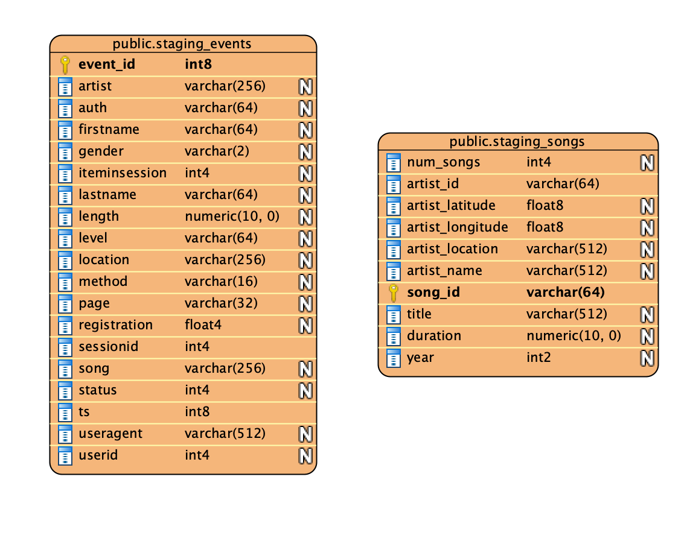
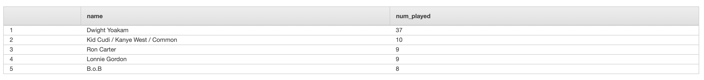

# Data WareHouse with Redshift

## Intro to the Dataset
The primary datasource for this project comes from two prefixes in the udacity-dend
S3 bucket.

There are several log_data json files that contain several lines each
of songplay events. The ones with page = "NextSong" are the ones we're 
interested in as they represent the actual instance of a song being played.
These are imported from the log_data folder using the log_json_path.json json file. 

There are also json_files under song_data folder that contain several dimensions
to join with the log_data.

## Purpose
The purpose of this exercise is to build an ETL pipeline in Redshift
to ingest data from the json table into staging tables and then build
optimized dimensional tables for analytics from the original transactional 
representation. 


## Schema design

The staging tables are designed to match the columns available in the json data.



The varchar sizes are finalized after trial load with different sizes for various fields.
Since, the dimensional tables are formed primarily by joining on the artist name, 
along with matching the song title and duration (from project 1), we choose
artist name as the distkey, and song title as the sortkey to speed up the joins
and minimize shuffling.

Then the dimensional tables are build out to a Star Schema,
with the events Facts at the center surrounded by relevant
dimension tables.


Star schema is apt for this database, since there is one central source
of event which stems from songplay and all metadata information is centered
around this event play.

The user and artist table are relatively small (104 and 10025 respectively),
we use diststyle all to broadcast these to all nodes, to enable quick joins and 
minimize shuffling. 

Even though the time table is also small currently, this could potentially
grow faster than artists and user table, as this relates to songplay events
so we will keep this as diststyle auto.

Wherever start_time is present, we will use that as the sorting key.

Then we will use song_id as the distkey to keep events pertaining
to certain songs on the same nodes. Finally we sort on artist name
since we anticipate this will be a frequently accessed field in our queries.


## Files in the Repository and Running the code
create_tables.py is responsible for clearing the previous tables
and creating new tables according to the template in sql_queries.py.
Open dwh.cfg and in create_database, edit the redshift hostname and ARN
information as needed, for our database.

The database itself is created using the iac.ipynb file.

Run create_tables.py to create the initial tables.
```
> python create_tables.py
```


Now, run etl.py to generate tables with the full data.

## Example queries
##### Top played artists
```
SELECT name, COUNT(DISTINCT songplay_id) as num_played FROM songplays JOIN artists ON songplays.artist_id = artists.artist_id GROUP BY name ORDER BY num_played DESC LIMIT 5;
```



