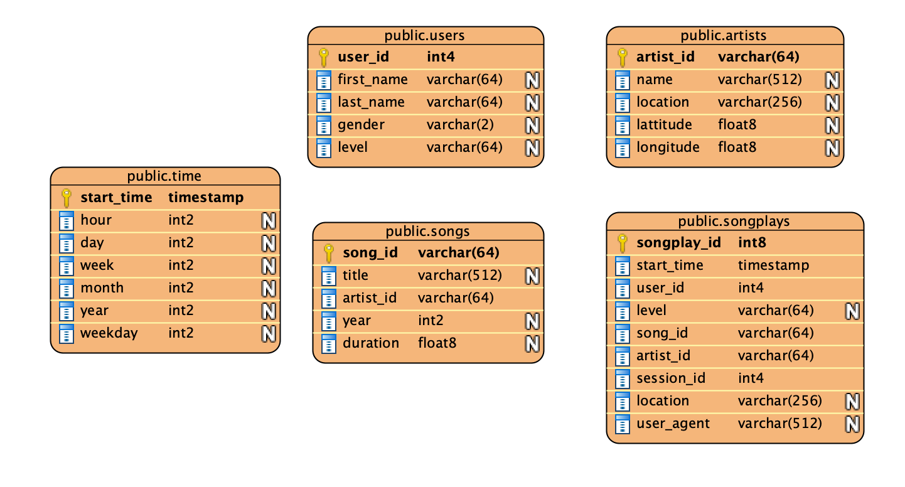

# Data Lake with Spark

## Intro to the Dataset
The primary datasource for this project comes from two prefixes in the udacity-dend
S3 bucket.

There are several log_data json files that contain several lines each
of songplay events. The ones with page = "NextSong" are the ones we're 
interested in as they represent the actual instance of a song being played.
These are imported from the log_data folder using the log_json_path.json json file. 

There are also json_files under song_data folder that contain several dimensions
to join with the log_data.

## Purpose
The purpose of this exercise is read the json files from s3 into Spark SQL dataframes 
and to write them out after transformation back to S3.


## Schema design


Then the dimensional tables are build out to a Star Schema,
with the events Facts at the center surrounded by relevant
dimension tables. This schema is however a schema on read, 
specified at time of ingestion into spark.





Star schema is apt for this database, since there is one central source
of event which stems from songplay and all metadata information is centered
around this event play.


## Files in the Repository and Running the code
 
dl.cfg needs to be filled with the AWS credentials to access the data from S3.

etl.py is the main file with the spark code which can be run as a spark job
on EMR.


```
> etl.py create_tables.py
```


